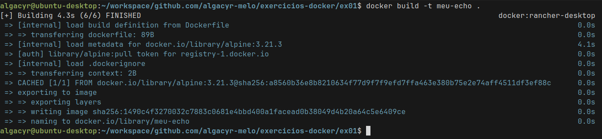

# ex01

## Quebrando a descrição

1. Crie um arquivo Dockerfile que utilize a imagem alpine como base...
    ```Dockerfile
    FROM alpine:3.21.3
    ```

2. ...e imprima a mensagem Olá, Docker! ao ser executada.
    ```Dockerfile
    CMD [ "echo", "Olá, Docker!" ]
    ```

3. Construa a imagem com o nome "meu-echo"...
    ```bash
    docker build -t meu-echo .
    ```

4. ...e execute um container a partir dela.
    ```bash
    docker run --rm meu-echo
    ```


