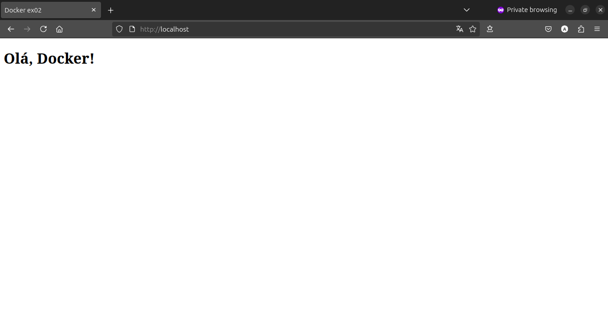

# ex02

## Quebrando o problema

1. Crie um container com Nginx...
    ```bash
    docker run --rm --name ex02-nginx -d nginx
    ```

2. ...que sirva uma página HTML customizada ([index.html](html/index.html)).
    ```html
    <!DOCTYPE html>
    <html lang="pt-BR">
    <head>
        <meta charset="UTF-8">
        <title>Docker ex02</title>
    </head>
    <body>
        <h1>Olá, Docker!</h1>
    </body>
    </html>
    ```

3. Monte um volume local com esse arquivo para que ele apareça
na raíz do site (/usr/share/nginx/html).
    ```bash
    docker run --name ex02-nginx -v $(pwd)/html:/usr/share/nginx/html -d nginx
    ```

4. Acesse a página via _http://localhost_
    ```bash
    docker run --name ex02-nginx -v $(pwd)/html:/usr/share/nginx/html -dp 80:80 nginx
    ```

