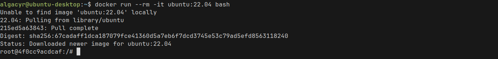
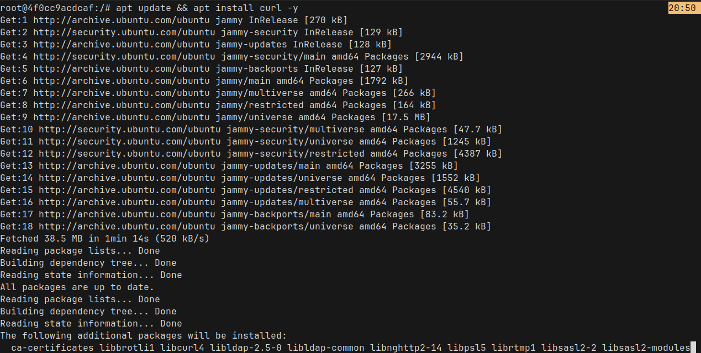

# ex03

## Quebrando o problema

1. Inicie um container da imagem ubuntu com um terminal interativo
    ```bash
    docker run --rm -it ubuntu:24.04 bash
    ```
    

2. Navegue pelo sistema de arquivos e instale o pacote curl utilizando apt
    ```bash
    apt update && apt install curl -y
    ```
    
