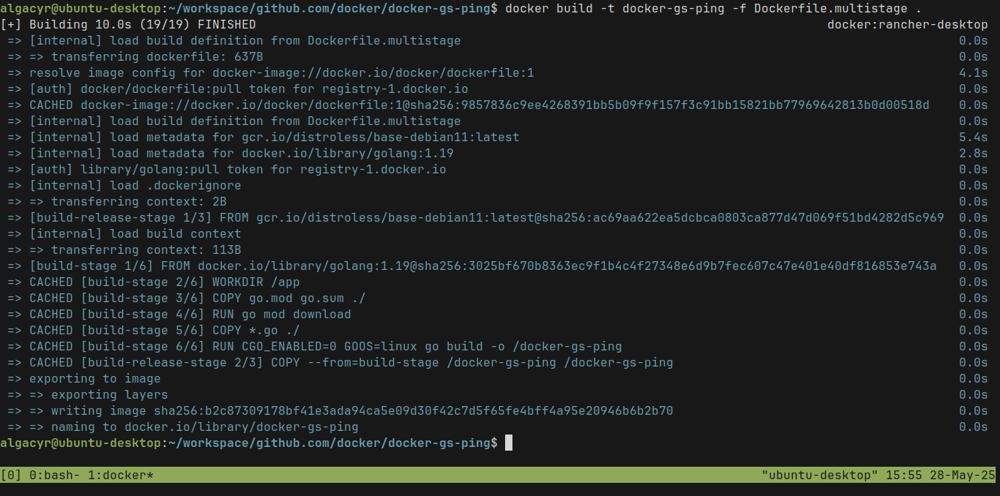
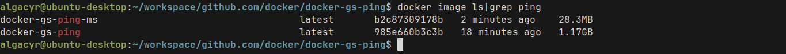
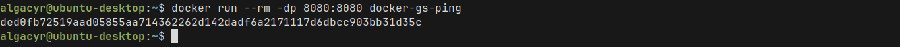
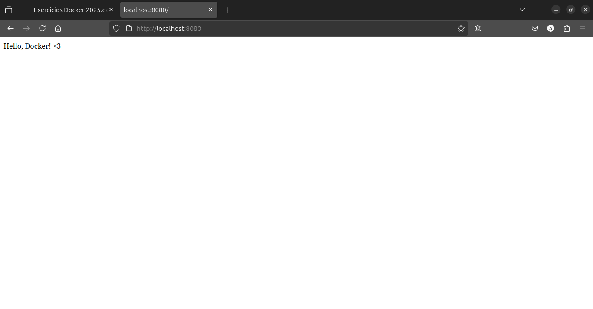

# ex06

## Quebrando o problema

1. Utilize um multi-stage build para otimizar uma aplicação Go,
reduzindo o tamanho da imagem final.

    
    _multi-stage build_

    
    _before vs after multi-stage build_

2. Utilize para praticar o projeto gs-ping desenvolvido em Golang

    
    _run docker-gs-ping_

    
    _localhost:8080_
