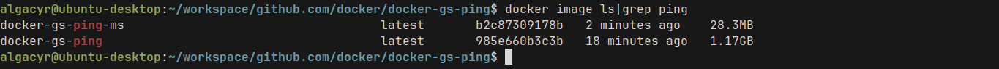
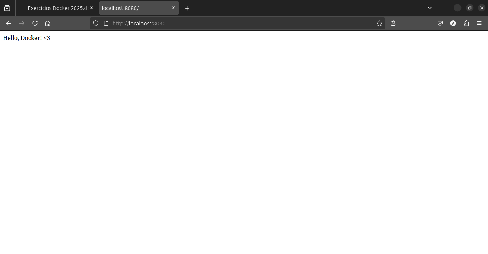

# ex06

## Quebrando o problema

1. Utilize um multi-stage build para otimizar uma aplicação Go,
reduzindo o tamanho da imagem final.

- Dockerfile original:
    ```Dockerfile
    # syntax=docker/dockerfile:1

    FROM golang:1.19

    # Set destination for COPY
    WORKDIR /app

    # Download Go modules
    COPY go.mod go.sum ./
    RUN go mod download

    # Copy the source code. Note the slash at the end, as explained in
    # https://docs.docker.com/engine/reference/builder/#copy
    COPY *.go ./

    # Build
    RUN CGO_ENABLED=0 GOOS=linux go build -o /docker-gs-ping

    # To bind to a TCP port, runtime parameters must be supplied to the docker command.
    # But we can (optionally) document in the Dockerfile what ports
    # the application is going to listen on by default.
    # https://docs.docker.com/engine/reference/builder/#expose
    EXPOSE 8080

    # Run
    CMD [ "/docker-gs-ping" ]
    ```

- Dockerfile com multi-stage:
    ```Dockerfile
    # syntax=docker/dockerfile:1

    ##
    ## Build the application from source
    ##

    FROM golang:1.19 AS build-stage

    WORKDIR /app

    COPY go.mod go.sum ./
    RUN go mod download

    COPY *.go ./

    RUN CGO_ENABLED=0 GOOS=linux go build -o /docker-gs-ping

    ##
    ## Run the tests in the container
    ##

    FROM build-stage AS run-test-stage
    RUN go test -v ./...

    ##
    ## Deploy the application binary into a lean image
    ##

    FROM gcr.io/distroless/base-debian11 AS build-release-stage

    WORKDIR /

    COPY --from=build-stage /docker-gs-ping /docker-gs-ping

    EXPOSE 8080

    USER nonroot:nonroot

    ENTRYPOINT ["/docker-gs-ping"]
    ```

    

2. Utilize para praticar o projeto gs-ping desenvolvido em Golang


