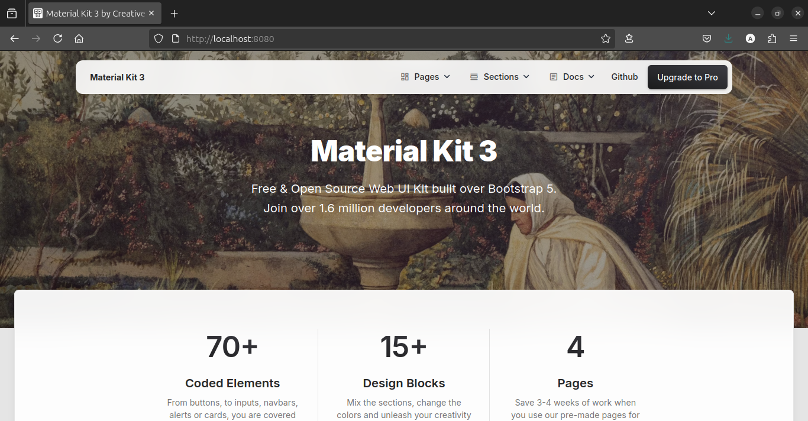

# ex09

## Descrição
Construa uma imagem baseada no Nginx ou Apache, adicionando um site
HTML/CSS estático. Utilize a landing page do Creative Tim
para criar uma página moderna hospedada no container

```Dockerfile
FROM nginx:alpine

COPY material-kit-site /usr/share/nginx/html

EXPOSE 80
```

```bash
docker run -dp 8080:80 material-kit-site
```


