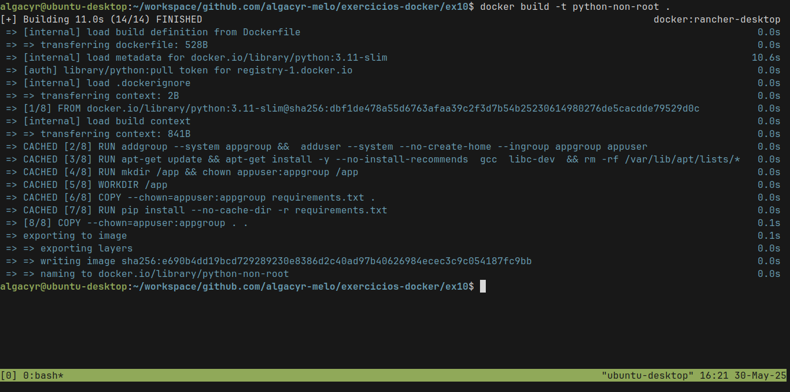
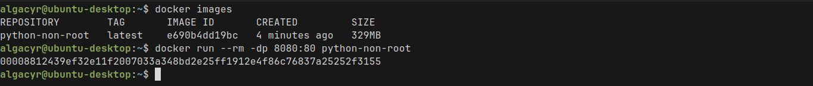

# ex10

## Descrição
Ao rodar containers com o usuário root, você expõe seu sistema a riscos
maiores em caso de comprometimento. Neste exercício, você deverá criar
um Dockerfile para uma aplicação simples (como um script Python ou
um servidor Node.js) e configurar a imagem para rodar com um usuário
não-root.

## Quebrando o problema

1. Criar usuário com useradd ou adduser no Dockerfile
    ```Dockerfile
    RUN addgroup --system appgroup && \
        adduser --system --no-create-home --ingroup appgroup appuser
    ```

2. Definir esse usuário como padrão com a instrução USER
    ```Dockerfile
    USER appuser
    ```

3. Construir a imagem e iniciar o container
    ```bash
    docker build -t python-non-root .
    ```
    

    ```bash
    docker run -dp 8080:80 --name hello-python python-non-root
    ```
    

    

