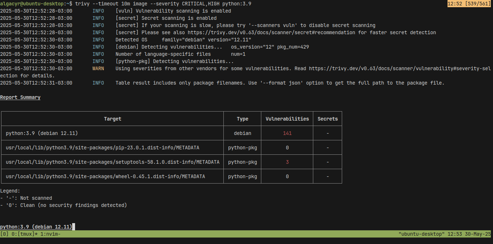
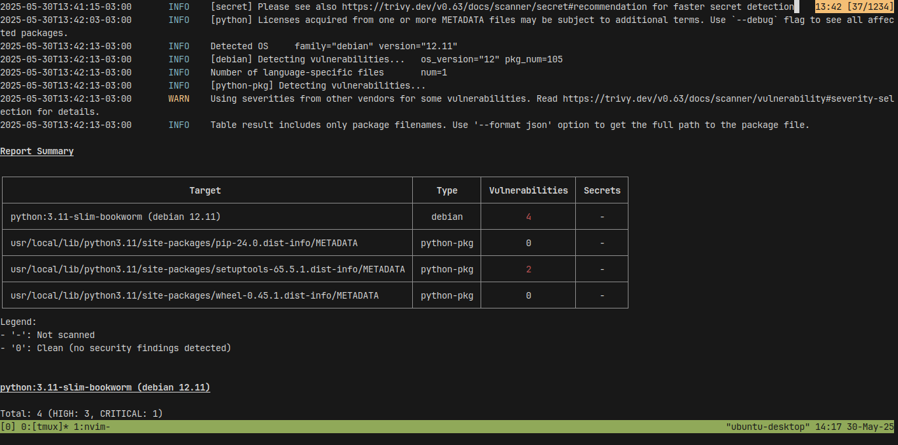

# ex11

## Descrição
Trivy é uma ferramenta open source para análise de vulnerabilidades em imagens
Docker. Neste exercício, você irá analisar uma imagem pública, como python:3.9
ou node:16, em busca de vulnerabilidades conhecidas.

1. Instalação do Trivy
    ```bash
    curl -sfL https://raw.githubusercontent.com/aquasecurity/trivy/main/contrib/install.sh | sudo sh -s -- -b /usr/local/bin v0.63.0
    ```

2. Análise da Imagem
    ```bash
    trivy --timeout 10m image python:3.9
    ```

3. Análise com filtro de severidade (CRITICAL, HIGH)
    ```bash
    trivy --timeout 10m image --severity CRITICAL,HIGH python:3.9
    ```

    

4. Vulnerabilidades Encontradas:

- libaom3, version 3.6.0-1+deb12u1 (CVE-2023-6879) **CRITICAL**
aom: heap-buffer-overflow on frame size change

    **O que é?**
    - AV1 Video Codec Library

    **Ações:**
    - Mudança de imagem base para python:3.11-slim-bookworm
    ```Dockerfile
    FROM python:3.11-slim-bookworm
    ```

- libopenexr-3-1-30, vlibopenexr-dev, version 3.1.5-5 (CVE-2023-5841) **CRITICAL**
OpenEXR: Heap Overflow in Scanline Deep Data Parsing

    **O que é?**
    - runtime files for the OpenEXR image library

    **Ações:**
    - Mudança de imagem base para python:3.11-slim-bookworm
    ```Dockerfile
    FROM python:3.11-slim-bookworm
    ```

- zlib1g, 1:1.2.13.dfsg-1 (CVE-2023-45853) **CRITICAL**
zlib: integer overflow and resultant heap-based buffer

    **O que é?**
    - compression library - runtime

    **Ações:**
    - Mudança de imagem base para python:3.11-slim-bookworm
    ```Dockerfile
    FROM python:3.11-slim-bookworm
    ```

    

## Conclusão
A migração para python:3.11-slim-bookworm resolve todas as vulnerabilidades críticas identificadas, pois:

- Utiliza Debian 12 (Bookworm) como base
- Inclui versões atualizadas dos pacotes vulneráveis
- Mantém compatibilidade com aplicações Python
