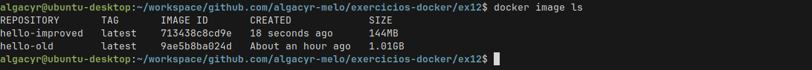

# ex12

## Descrição
Após identificar vulnerabilidades com ferramentas como o Trivy, o próximo passo
é corrigi-las. Imagens grandes e genéricas frequentemente trazem bibliotecas
desnecessárias e vulneráveis, além de usarem o usuário root por padrão. Neste
exercício, você irá trabalhar com um exemplo de Dockerfile com más práticas e
aplicar melhorias para construir uma imagem mais segura e enxuta.
Identifique as melhorias e gere uma nova versão de Dockerfile

## Mudanças Aplicadas

1. Imagem base mais leve e segura
    ```Dockerfile
    FROM python:3.9-slim-bookworm
    ```

2. Usuário não root
    ```Dockerfile
    RUN groupadd -r appuser && useradd -r -g appuser appuser
    ```

3. Instalar dependências com limpeza de cache
    ```Dockerfile
    RUN pip install --no-cache-dir --upgrade pip && \
        pip install --no-cache-dir -r requirements.txt
    ```

4. Ajustar permissões e mudar usuário
    ```Dockerfile
    RUN chown -R appuser:appuser /app
    USER appuser
    ```


