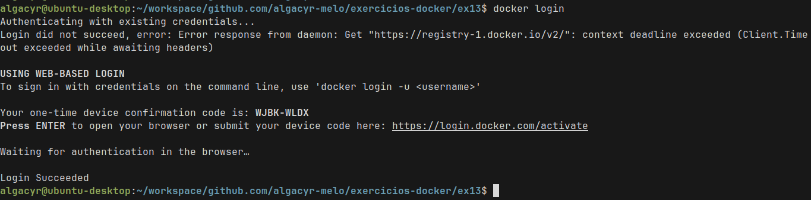
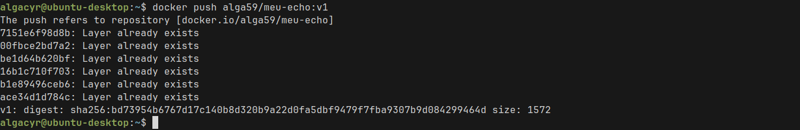

# ex13

## Descrição
Crie um Dockerfile que use a imagem python:3.11-slim,
copie um script Python local (app.py) e o execute com CMD.
O script pode imprimir a data e hora atual.

```Dockerfile
FROM python:3.11-slim

WORKDIR /app

COPY app.py .

CMD [ "python", "app.py" ]
```

1. Crie uma conta no Docker Hub

2. Faça login pelo terminal com docker login
    
    _docker hub login_

3. Rebuild sua imagem meu-echo e a renomeie no formato seu-usuario/meu-echo:v1
    ```bash
    docker build -t meu-echo .
    docker tag meu-echo alga59/meu-echo:v1
    ```

4. Faça o push da imagem para o Docker Hub
    
